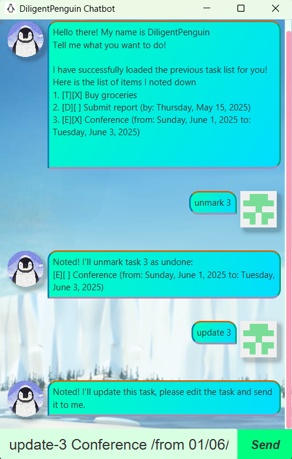
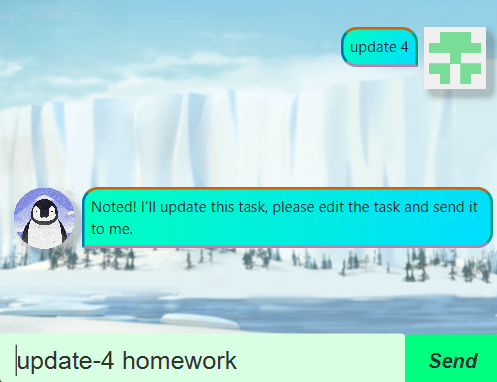
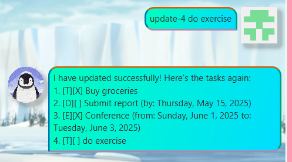
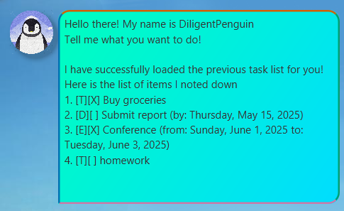

Diligent Penguin is a simple and efficient chatbot application designed to
help users manage their daily tasks.
The chatbot enables users to add, edit, delete, and view their task list effortlessly through an interactive conversation.

## Features
### Add a todo task: `todo`
Add a new task with a description to the task list.

**Format:**
```
todo <description>
```
**Examples:**
```
todo submit report
```

### Add a deadline task: `deadline`
Add a new task with a description and a deadline to the task list.

**Format:**
```
deadline <description> /by <deadline>
```
**Note:** The deadline format is `dd/mm/yyyy`.

**Examples:**
```
deadline grade homework /by 19/02/2025
```

### Add an event task: `event`
Add a new task with a description, a start time, and an end time to the task list.

**Format:**
```
event <description> /from <start_time> /to <end_time>
```
**Note:** Start time and end time format is `dd/mm/yyyy`.

**Examples:**
```
event attend hackathon /from 20/02/2025 /to 21/02/2025
```

### List all tasks: `list`
List all pending and completed tasks.

**Format:**
```
list
```


### Mark task as completed: `mark`
Mark a task at a given index as completed.

**Format:**
```
mark <task_index>
```
**Examples:**
```
mark 3
```

### Mark task as uncompleted: `unmark`
Mark a task at a given index as uncompleted.

**Format:**
```
unmark <task_index>
```
**Examples:**
```
unmark 3
```

### Delete a task: `delete`
Remove a completed or unnecessary task at a given index from the list.

**Format:**
```
delete <task_index>
```
**Examples:**
```
delete 3
```

### Update a task: `update`
Update a task at a given index from the list.  
**Note:** You cannot change the task type.

**Format 1 (Short command):**
```
update <task_index>
```
This command pre-fills your next command with a detailed update command containing the current description. You can edit the task description and send the command to perform the update.

**Format 2 (Detailed command):**
```
update-<task_index> <task description>
```
This command updates the task at the given index with the new description.

  


### Locate tasks by keyword: `find`
Locate all tasks in the list that contain a given keyword.

**Format:**
```
find <key_word>
```


### Automatic Saving and Loading Data
DiligentPenguin automatically saves the task list after each command. There is no need to save manually.  
Once opened, DiligentPenguin automatically loads data from the previous session (if it exists).



## Installation
1. Ensure you have Java `17` or above installed on your computer.
2. Download the latest `.jar` file from [here](https://github.com/DiligentPenguinn/ip/releases/tag/A-Release).
3. Copy the file to the folder you want to use as the home folder for your DiligentPenguin chatbot.
4. Open a command terminal, `cd` into the folder you put the `.jar` file in, and use the following command to run the application:
`java -jar diligentpenguin-v1.0.jar`